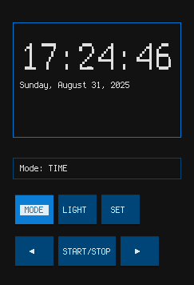

A digital clock application that mimics traditional digital watch controls using Textual and EnGlyph for the display. Here are the key features:
Digital Clock Features



Display Modes:

    TIME: Shows current time with date
    ALARM: Shows and sets alarm time
    STOPWATCH: Precision timing with hundredths
    TIMER: Countdown timer functionality

Traditional Watch Controls:

    MODE: Cycles through TIME → ALARM → STOPWATCH → TIMER
    SET: Enters setting mode for current display (hour → minute → second)
    ◀/▶: Decrease/increase values when setting
    START/STOP: Controls stopwatch and timer operation
    LIGHT: Reset function (clears stopwatch when stopped, resets timer)

Visual Features:

    Large EnGlyph text for the main time display (xx-large size)
    Blinking segments when setting values (just like old digital watches)
    Status indicators (ALM for alarm, SW for stopwatch running, TMR for timer)
    Traditional button layout similar to classic Casio/Timex watches

Setting Operations:

    Time Setting: MODE → SET → use ◀/▶ to adjust hour → SET → adjust minute → SET → adjust second → SET to confirm
    Alarm Setting: MODE to ALARM → SET → adjust hour → SET → adjust minute → SET to enable
    Stopwatch: MODE to STOPWATCH → START/STOP to control → LIGHT to reset when stopped
    Timer: MODE to TIMER → ◀/▶ to set duration → START/STOP to control

The interface captures the classic digital watch experience with modern TUI styling. The EnGlyph integration provides crisp, scalable text that resembles traditional LCD displays, while the button controls work exactly like those physical watch buttons we all remember!

```sh
uvx --from git+https://github.com/friscorose/dumbwatch dumbwatch
```

```sh
uv tool install --from git+https://github.com/friscorose/dumbwatch dumbwatch
```

```sh
dumbwatch
```
